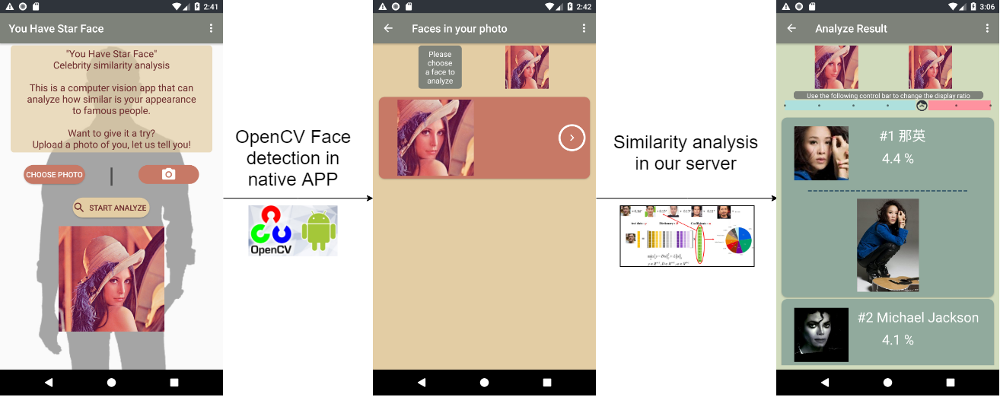

# android-final-project
Android應用程式開發 ANDROID APP DEVELOPMENT 期末專案

專案名稱：「明星臉比一比」名人相似度分析

這是一個電腦視覺APP， 能夠分析照片中的人長的像哪些知名人物。使用者選擇一張照片之後，會先透過OpenCV在手機端簡略找出人臉出現的區域，之後會將找到的人臉上傳到我們搭建的伺服器上進行完整相似度分析。

<!-- 詳細介紹與說明請參考 [app_intro.md](app_intro.md) -->

## Prebuild APK File
Prebuild APK file is located in `final_project\apks\your_have_star_face_v1.apk`.

your can click [here to download.](https://github.com/johnson18404/android-final-project/raw/master/final_project/apks/your_have_star_face_v1.apk) 

## Presentation slides
[slides](https://docs.google.com/presentation/d/1NdUjPPXyTI4isDLCC2znDM8wkyT4uHbJZsy9zbpWQz8/edit#slide=id.g5bf75c0000_0_517)

## list of tools, libraries and techniques 

* We use most of codelabs in `Codelabs for Android Developer Fundamentals (V2)` https://developer.android.com/courses/fundamentals-training/toc-v2
    * 1.3: Text and scrolling views
    * 2.1: Activities and intents
    * 2.2: Activity lifecycle and state
    * 3.3: Support libraries
    * 4.2: Input controls
    * 4.3: Menus and pickers (options menu)
    * 4.4: User navigation
    * 4.5: Recycleview
    * 5.1: Drawables, styles, and themes
    * 5.2: Cards and colors (CardView)
    * 5.3: Adaptive layouts (Localize-english)
    * 7.1: AsyncTask
    * 9.1: Shared preferences
    * 9.2: App settings

* Other libraries that we use in APP
    * android image compression library `id.zelory:compressor:2.1.0` https://github.com/zetbaitsu/Compressor

    * OpenCV `opencv-3.4.3-android-sdk` https://opencv.org/

* tools, libraries and techniques used in backend analyze server:
    * Dlib http://dlib.net/
    * OpenFace http://cmusatyalab.github.io/openface/
    * SPArse Modeling Software http://spams-devel.gforge.inria.fr/
    * scikit-learn https://scikit-learn.org/
    * flask http://flask.pocoo.org/

## Contributions of each team member
* Group#14	IKMLAB	You Have Star Face
		
* 王鈺云 P76071349: 50% 
    * Development discussion
    * Assets collection 
    * Layout Design
    * APP components behavier implementation
    * Presentation slides

* 蔡文傑 P76074240: 50% 
    * Development discussion
    * Human face dataset collection
    * APP components behavior implementation
    * Face detection on APP (Android OpenCV)
    * Similar face image retrieval in backend analyze server (openface-landmark & our human face dataset)
    * Presentation slides

## Notice for build apk by yourself
The Server settings file is not included in this code. If you want to build the APK file yourself, please contact us.